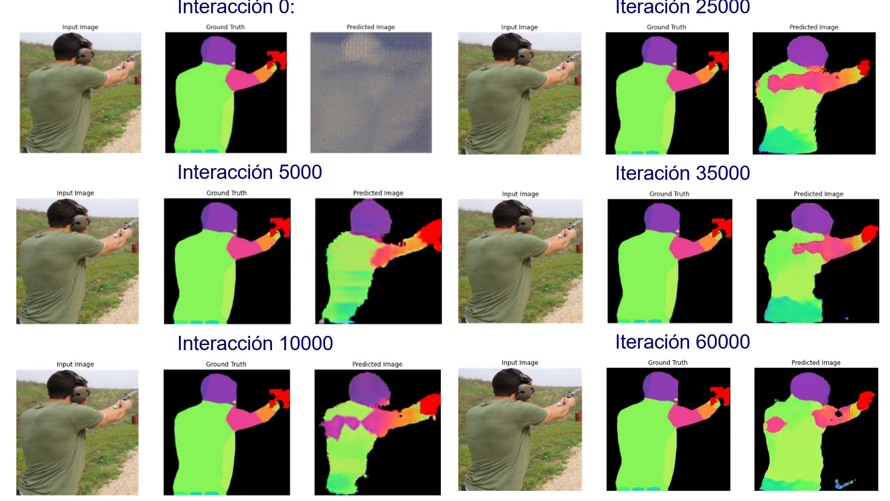
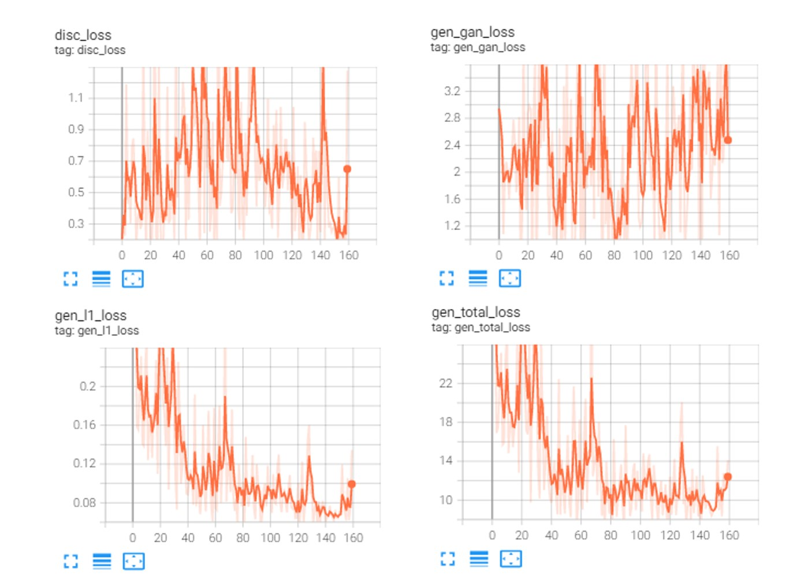

#	Organización de proyecto y licenciamiento

El proyecto tiene una licencia MIT License Open Source, en donde se proporciona el código en las versiones liberas y modificadas en el reportorio GIT, tal como está, en donde expresamente no existe responsabilidad por daños y perjuicios. Esta es una licencia de código abierto, que permite a cualquiera tener la libertad de usar el código y mejorarlo. 
El repositorio de código fuente se encuentra distribuido de la siguiente manera:
 	
* data: Ruta donde se encuentran las diferentes imágenes procesadas utilizadas como recursos para el entrenamiento de los modelos basados en redes generativas.
* model: Ruta donde se encuentran los diferentes notebooks, utilizados para la generación de modelos utilizados tanto para la detección de objetos y la segmentación de imágenes.
* aplications: Tiene notebooks utilizados para realizar el procesamiento de videos.
* resources: Tiene los recursos utilizados para el desarrollo del proyecto incluye el documento formal TFM, donde se explican los diferentes modelos y el trabajo.

# Ejemplo:

#	Red de segmentación GAN 

A continuación, se realiza una descripción de lo modelo de segmentación mediante el uso de redes antagónicas, en donde se hace uso de las imágenes generadas en los apartados anteriores. El entorno de trabajo es Google Colaborador en su versión Pro+, adicionalmente se utilizo 
Para esta tarea se realizó el siguiente notebook que se encuentran en el repositorio Git:

[8TFMModeloGANPix2Pix_Unet.ipyn](code\model\notebooks\gans\8TFMModeloGANPix2Pix_Unet.ipynb) 

- **Red:** Modelo detección y segmentación de personas armadas
Contexto: Se desea crear un modelo que permita segmentar personas con armas cortas.
- **Problema:** El objetivo del proyecto es permitir que mediante las técnicas de mejoras en la segmentación de objetos en imágenes se puedan proponer nuevos sistemas de vigilancia y alerta temprana contra sospechosos de intento de asesinato y porte ilegal de armas. Es necesario crear un modelo de segmentación de personas con armadas con armas cortas, basados en un conjunto de datos pre-entrenados mediante el uso de redes GAN y arquitecturas pensadas para la segmentación de objetos.
- **Solución:** Se construye una red antagónica generativa condicional (cGAN) basada en el trabajo de pix2pix una red que realiza un proceso de mapaeo de imágenes de entrada hacia imágenes de salida. Este proceso se conoce como la traducción de imagen a imagen con GANs, trabajo realizado por Isola et al. en el 2017. Se puede utilizar está arquitectura de red multipropósito ya que este trabajo se puede aplicar en varias tareas, Por ejemplo: síntesis de fotos a partir de mapas, generación de fotos con color a partir de imágenes en blanco y negro, conversión de fotos de Google Maps en imágenes aéreas e incluso la transformación de bocetos en fotos.
Entorno: con GPU.
- **Licencia:** MIT, La licencia del Massachusetts Institute of Technology (MIT) es un software de licencia gratuito.
Características de la red pix2pix
Red GAN Segmentación de personas con armas, se desarrollará una red que generará imágenes segmentadas de las partes del cuerpo de una persona armada. Utiliza una base de datos que contiene a las personas y las armas segmentadas (color rojo), trabajo desarrollado por Miguel Ponce, estudiante de la Universidad de UOC, en el Máster de Ciencia de Datos. 

## La arquitectura de esta red está formada por:

*	Genrador: una arquitectura basada en U-Net.
*	Discriminador: representado por un clasificador PatchGAN convolucional propuesto en el artículo de pix2pix. 
*	Épocas: Se debe tomar en cuenta que cada época puede demorar alrededor varias horas dependiendo de la cantidad de GPU aprovisionada. Se realizara el entrenamiento de la red cGAN entre 40000 hasta 70000 épocas en el conjunto de datos.
Conjunto de datos
Cada imagen tiene un tamaño de 256 x 512 pixeles, y se subdivide en dos imágenes de tamaño 256 x 256 pixeles, a la izquierda esta la imagen segmentada y a la derecha la imagen original. Se muestra de las imágenes de entrada a la derecha real y a la izquierda la misma imagen pero segmentada.

  
Respeto de las tareas de procesamiento se aplica rotaciones y reflejos aleatorios(random_jitter) para preprocesar el conjunto de entrenamiento; según la recomendación de la publicación de la red Pix2Pix; en donde tenemos las funciones:

*	Se cambia el tamaño de cada imagen 256 x 256 a una mayor altura y anchura: 266 x 266.
*	Se recorta aleatoriamente a 256 x 256.
*	Se voltea aleatoriamente la imagen horizontalmente, es decir, de izquierda a derecha (espejo aleatorio).
*	Se Normaliza las imágenes al rango [-1, 1].
 

## GENERADOR

El generador de la red pix2pix cGAN es una red U-Net modificada. Una U-Net consta de un codificador (disminución de muestreo) y un decodificador (disminución de muestreo). En donde cada bloque del codificador está formado por: Convolution -> Batch normalization -> Leaky ReLU. Cada bloque en el decodificador es: Transposed convolution -> Batch normalization -> Dropout (aplicado a los 3 primero bloques) -> ReLU. Existen conexiones de salto entre el codificador y el decodificador. Se puede ver la definición de esta arquitectura detallada en, el anexo 8.5 Arquitectura Generador; sin embargo, el proceso que sigue en generador es el que se muestra en la siguiente figura:
 
Podemos visualizar un ejemplo del generador para un tensor con la forma: TensorShape([1, 256, 256, 3])
 
**Pérdida del generador**

Las cGAN aprenden de una pérdida que penaliza una posible estructura que difiere de la salida de la red y la imagen de destino, como se describe en el artículo Image-to-Image Translation with Conditional Adversarial Networks.

-	gan_loss, es la pérdida del generador es una pérdida de entropía cruzada sigmoidea de las imágenes generadas y una matriz de unos.
-	L1, es una pérdida que mide el MAE (error absoluto medio) entre la imagen generada y la imagen de destino. Esto permite que la imagen generada se vuelva estructuralmente similar a la imagen de destino.
La fórmula para calcular la pérdida total del generador es la suma de la perdida de la red GAN(gan_loss) + LAMBDA * l1_loss, donde LAMBDA = 100.
## DISCRIMINADOR

PatchGAN es un tipo de discriminador para redes antagónicas generativas que solo penaliza la estructura a escala de parches de imagen locales. El discriminador PatchGAN intenta clasificar si cada parche en una imagen es real o falso. Este discriminador se ejecuta de forma convolucional a través de la imagen, promediando todas las respuestas para proporcionar el resultado final. Dicho discriminador modela efectivamente la imagen como un campo aleatorio de Markov, suponiendo independencia entre píxeles separados por más de un diámetro de parche. Puede entenderse como un tipo de pérdida de textura/estilo(Papers with Code - PatchGAN Explained, n.d.), se puede ver la aquitecutra detallada en el anexo 8.6 Arquitectura Discriminador; sin embargo, el proceso que sigue en discriminador es el que se muestra en la siguiente figura:
 
El discriminador es un clasificador PatchGAN convolucional que intenta clasificar si cada imagen parche es real o no, en donde:
-	Cada bloque en el discriminador es: Convolution -> Batch normalization -> Leaky ReLU.
-	La forma de la salida después de la última capa es (batch_size, 30, 30, 1).
-	Cada parche de imagen 30 x 30 de la salida clasifica una porción 70 x 70 de la imagen de entrada.
El discriminador recibe 2 entradas:
-	La imagen de entrada y la imagen de destino, que debe clasificar como real.
-	La imagen de entrada y la imagen generada (la salida del generador), que debe clasificar como falsa.
-	Utiliza tf.concatenate([inp, tar], axis=-1) para concatenar estas 2 entradas juntas.
Podemos visualizar un ejemplo del generador para un tensor con la forma: TensorShape([1, 256, 256, 3])
 
**Pérdida del discriminador**
La función discriminator_loss tiene 2 entradas: las imágenes reales y las imágenes generadas.

-	real_loss: es una pérdida de entropía cruzada sigmoidea de las imágenes reales y una matriz de unos (ya que estas son las imágenes reales).
-	generated_loss: es una pérdida de entropía cruzada sigmoidea de las imágenes generadas y una matriz de ceros (ya que estas son las imágenes falsas).
La pérdida total es la suma de la pérdida real y la pérdida generada.

## Optimizadores
Utiliza Adam, ya que es un algoritmo popular en el campo del aprendizaje profundo porque logra buenos resultados rápidamente. Resultados empíricos demuestran que Adam funciona bien en la práctica y se compara favorablemente con otros métodos de optimización estocástica. Jason Brownlee define los parámetros de Adam según(Brownlee, 2017):
-	alfa. También se conoce como tasa de aprendizaje o tamaño de paso. La proporción en que se actualizan los pesos (por ejemplo, 0,001). Los valores más grandes (p. ej., 0,3) dan como resultado un aprendizaje inicial más rápido antes de que se actualice la tasa. Los valores más pequeños (por ejemplo, 1.0E-5) ralentizan el aprendizaje durante el entrenamiento
-	beta1. La tasa de caída exponencial para las estimaciones del primer momento.
-	beta2. La tasa de caída exponencial para las estimaciones del segundo momento. Este valor debe establecerse cerca de 1,0 en problemas con un gradiente escaso por ejemplo para problemas de visión por computadora.
-	épsilon. Es un número muy pequeño para evitar cualquier división por cero en la implementación.
generator_optimizer = tf.keras.optimizers.Adam(2e-4, beta_1=0.5)
discriminator_optimizer = tf.keras.optimizers.Adam(2e-4, beta_1=0.5)
## Proceso de entrenamiento:
El proceso es el siguiente:
- El generador para cada imagen de entrada genera una imagen de salida.
- El discriminador recibe la imagen de entrada y la imagen generada como primera entrada. La segunda entrada es input_image y target_image.
- Calcular el generador y la pérdida del discriminador.
- Calcular las pérdidas con respecto tanto al generador y al discriminador(entradas) y se deben aplicar al optimizador.

 
## Algunos resultados son:
	
 	 
  
## Resultados Métricas:	 
	

## Evaluación general del modelo:

La interpretación de los registros es más compleja y abstracta cuando se entrena una GAN (o una cGAN como pix2pix) respecto de otros modelos como clasificación o regresión. Debido a que se busca el equilibrio en la red según la teoría de Nashm se puede comprobar que ni el generador ni el discriminador han "ganado".
-	Debido a que gen_gan_loss o disc_loss son muy altos, es un indicador que el modelo combinado está entrenando correctamente.
-	El valor log(3) = 0,47 es un buen punto de referencia las pérdidas, ya que indica una perplejidad de 3: el discriminador, en promedio, tiene la misma incertidumbre sobre las dos opciones.
-	Para disc_loss, un valor por debajo de 0,47 significa que el discriminador lo está buscando discriminar de manerar aleatoria en el conjunto combinado de imágenes reales y generadas.
-	Para gen_gan_loss, un valor por debajo de 0,47 significa que el generador lo está haciendo mejor que el azar para engañar al discriminador.
-	A medida que avanza el entrenamiento, gen_l1_loss sigue disminuyendo. Luego la pérdida L1, también conocida como pérdida de error absoluta, que es la diferencia absoluta entre una predicción y el valor real. La pérdida L1 es un cálculo de error para cada ejemplo en el que queremos comprender qué tan bien predijimos para esa observación; luego un L1 que disminuye y tiende a cero es un buen indicador.
Otras métricas:
## Inception Score
---
Esta puntuación es una medida de cuán realista es la salida de una GAN. En palabras de sus autores, “encontramos que [el IS] se correlaciona bien con la evaluación humana [de la calidad de la imagen]”. Es una alternativa automática a que los humanos califiquen la calidad de las imágenes. Inception Score mide dos cosas simultáneamente:
-	Las imágenes tienen variedad (por ejemplo, cada imagen es una raza de perro diferente)
-	Cada imagen claramente se parece a algo diferente.
Si ambas cosas son ciertas, la puntuación será alta. Si uno o ambos son falsos, la puntuación será baja. Una puntuación más alta es mejor. Significa que su GAN puede generar muchas imágenes distintas diferentes. El IS ha demostrado ser útil y popular, aunque tiene limitaciones. El resultado de esta métrica es 1.0164841, ya que el modelo en realidad muestra una sola persona. 
## Intersection over Union
---
Esta métrica es muchas más interesante, también conocido como Índice Jaccard, es una de las métricas más utilizadas en la segmentación semántica. El IoU es el área de superposición entre la segmentación predicha y la verdadera. Esta métrica varía de 0 a 1 (0 a 100 %), donde 0 significa que no hay superposición y 1 significa una segmentación perfectamente superpuesta. Como se puede ver la métrica tiene un valor de 0.9043723442467624, lo que indica que el modelo está generando máscaras de segmentos muy parecido a la imagen original.
## Dice
---
El índice de Dice es muy similar al índice de Jaccard, ya que mide la similitud y diversidad de conjuntos de muestras. Aunque se calculan de manera similar, el índice de Dice es un poco más intuitivo porque se puede ver como el porcentaje de superposición entre dos conjuntos, que es un valor entre 0 y 1. Para este trabajo el índice es de 0.9397999999999994 por tanto se están solapando las imágenes real y predicha.
Finalmente se puede ver los resultados de otras pruebas en 8.7 Otras pruebas, de los Anexos, y en el repositorio de github en el siguiente enlace.
El resultado final de los pesos del modelo de segmentación de peronas con armas pre-entrenado es de 654MB.
